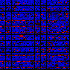
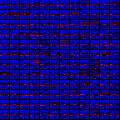

# Introduction

In order to use the trained model from DOOMBasic-v0 mission using A3C we first visualize the weights of the Convolution layers. The data flow graph of the Actor-Critic Network used is shown below.

## Architecture

### Input Image

Color: Grayscale

Dimension: 84 x 84

### Convolution Layer 1
Activation: ReLU

Kernel Size: 4 x 4

Stride: 2 x 2

Padding: VALID

Input Channels: 16

Output Channels: 32

Output Dimensions: 20 x 20

### Convolution Layer 2
Kernel Size: 8 x 8

Stride: 4 x 4

Padding: VALID

Input Channels: 1

Output Channels: 16

Output Dimensions: 9 x 9

### Dense Layer

Activation: ReLU

Input Dimension: 81

Output Dimension: 256

# Results

For visualization we have sampled around 1500 images from 500 different game instances. The visualization of all images can be found in `images` directory. Here we only show the visualization of 144 images.

For Visualizing the weights of the kernels 2 different methods were used to scale the weights to 0-255 range. In the first method simple extrapolation of Intensity was done by subtracting minimum value and dividing the difference of maximum and minimum. In the second method the first method was applied to scale the positive and negative weights to an RGB space where negative weights were set to be blue and positive weights were set to be red.

## Input

## Convolution Layer 1

Kernel | Scaling Method 1 | Scaling Method 2
-------|------------------|-----------------
0 |  | 
1 |  | 
2 |  | 
3 |  | 
4 |  | 
5 |  | 
6 |  | 
7 |  | 
8 |  | 
9 |  | 
10 |  | 
11 |  | 
12 |  | 
13 |  | 
14 |  | 
15 |  | 

## Convolutional Layer 2

Kernel | Scaling Method 1 | Scaling Method 2
-------|------------------|-----------------
0 |  | 
1 |  | 
2 |  | 
3 |  | 
4 |  | 
5 |  | 
6 |  | 
7 |  | 
8 |  | 
9 |  | 
10 |  | 
11 |  | 
12 |  | 
13 |  | 
14 |  | 
15 |  | 
16 |  | 
17 |  | 
18 |  | 
19 |  | 
20 |  | 
21 |  | 
22 |  | 
23 |  | 
24 |  | 
25 |  | 
26 |  | 
27 |  | 
28 |  | 
29 |  | 
30 |  | 
31 |  | 
